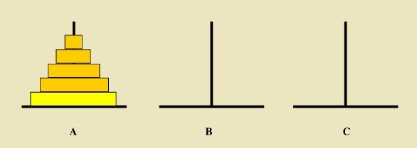
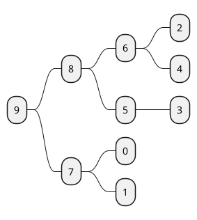

# 算法入门概念

- [1. 算法概念](#1-算法概念)
  - [1.1. 时间复杂度](#11-时间复杂度)
  - [1.2. 空间复杂度](#12-空间复杂度)
  - [1.3. 复习：递归](#13-复习递归)
    - [1.3.1. 汉诺塔问题](#131-汉诺塔问题)
- [2. 列表查找](#2-列表查找)
  - [2.1. 顺序查找](#21-顺序查找)
  - [2.2. 二分查找](#22-二分查找)
- [3. 列表排序](#3-列表排序)
  - [3.1. 快速排序](#31-快速排序)
  - [3.2. 堆排序](#32-堆排序)
    - [3.2.1. 树与二叉树](#321-树与二叉树)
      - [顺序存储](#顺序存储)
      - [链式存储](#链式存储)
    - [堆排序](#堆排序)
      - [堆的向下调整](#堆的向下调整)
      - [堆排序过程](#堆排序过程)

## 1. 算法概念

算法 (algorithm)，在数学和计算机科学之中，一个被定义好的、计算机可施行之指示的有限步骤或次序

### 1.1. 时间复杂度

- 用来估计算法运行时间的一个式子

- **一般来说**，时间复杂度高的算法比低的算法慢
指在机器差不多且问题规模相差不大的情况下

- 常见的时间复杂度
$
O(1)<O(logn)<O(n)<O(nlogn)<O(n^2)<O(n^2logn)<O(n^3)
$

- 复杂问题的时间复杂度
$
O(n!)O(2^n)O(n^n)
$

### 1.2. 空间复杂度

用来评估算法内存占用大小的一个式子，表示方法与时间复杂度一致

- 算法使用了几个变量：$O(1)$

- 算法使用了长度为 n 的一维列表：$O(n)$

- 算法使用了 m 行 n 列的二维列表：$O(mn)$

### 1.3. 复习：递归

递归的两个特点：

1. 调用自身

    ```python
    #函数没有调用自身，不是递归
    def sum(x,y):
        return x+y
    ```

2. 结束条件

    ```python
    #没有结束条件 或 结束条件无法导致结束，不是递归
    def add1(x):
        add1(x+1)

    def add2(x):
        if x>0:
            add2(x+1)
    ```

#### 1.3.1. 汉诺塔问题

有三根杆子 A，B，C。A 杆上有 N 个 (N>1) 穿孔圆盘，盘的尺寸由下到上依次变小。要求按下列规则将所有圆盘移至 C 杆：

每次只能移动一个圆盘；
大盘不能叠在小盘上面。

问：如何移？最少要移动多少次？



如果只有两个圆盘，我们知道只需要 3 步，而 N 个圆盘可以简化成 N-1 个圆盘加一个圆盘，这就是递归

```python
def hanoi(n):
    if n > 1:
        my_sum = 1 + 2 * hanoi(n - 1)
        return my_sum
    else:
        return 1


print(hanoi(4))
```

## 2. 列表查找

查找：在一些数据元素中，通过一定的方法找出与给定关键字相同的数据
元素的过程。
列表查找（线性表查找）：从列表中查找指定元素

- 输入：列表、待查找元素
- 输出：元素下标（未找到元素时一般返回 None 或 -1）
内置列表查找函数：index()
- 顺序查找
- 二分查找

### 2.1. 顺序查找

也叫线性查找，从列列表第⼀一个元素开始，顺序进⾏搜索，直到找到元素或搜索到列列表最后⼀一个元素为⽌止。
时间复杂度：O(n)
内置函数`index()`就是顺序查找

```python
def linear_search(li,val):
    for ind, v in enumerate(li):
        if val == v:
            return ind
    return None

```

### 2.2. 二分查找

又叫折半查找，从**有序**列列表的初始候选区 list[0:n] 开始，通过将*待查找* 的值与候选区*中间值* 比较，可以使候选区减少一半。

```python
def divide(li, val):
    left = 0
    right = len(li) - 1
    while right >= left:
        mid = (left + right) // 2
        if li[mid] > val:
            right = mid - 1
        if li[mid] == val:
            return mid
        if li[mid] < val:
            left = mid + 1
```

## 3. 列表排序

|排序 lowB 三人组|排序 NB 三人组|其它排序|
|---|---|---|
|冒泡排序|快速排序|希尔排序|
|选择排序|堆排序|计数排序|
|插入排序|归并排序|基数排序|

冒泡排序 \ \ \ \ 时间复杂度 $O(n^2)$
优化：如果在一趟遍历中没有发生任何交换，则可以终止排序

选择排序
缺点：多生成一个列表，空间复杂度加倍
优化：选出来的最小值与第一个数交换而不是插入到新的列表

插入排序
用两层循环实现
可以用递归实现，但 python 没有二级指针操作，似乎达不到 $O(n^2)$ 的时间复杂度

### 3.1. 快速排序

- 快速排序：快
- 快速排序思路：
  1. 取一个元素 p（第一个元素），使元素 p 归位
  2. 列表被分为两部分，左边比 p 小，右边比 p 大
  3. 递归完成排序

```python
import random


def partition(li, left, right):
    mid = li[left]
    while left < right:
        while left < right and li[right] >= mid:
            right -= 1
        if left >= right:
            break
        li[left] = li[right]
        left += 1
        if left >= right:
            break
        while left < right and li[left] <= mid:
            left += 1
        if left >= right:
            break
        li[right] = li[left]
        right -= 1
    li[left] = mid
    return left


def quick_sort(li, left, right):
    mid = partition(li, left, right)
    left1 = mid + 1
    right2 = mid - 1
    if left1 < right:
        quick_sort(li, left1, right)
    if left < right2:
        quick_sort(li, left, right2)


a = list(range(5))
random.shuffle(a)
print(a)
quick_sort(a, 0, len(a) - 1)
print(a)

```

时间复杂度：一般情况 $nlog(n)$，最坏情况 $n^2$

### 3.2. 堆排序

#### 3.2.1. 树与二叉树

- 树是一种可以递归定义的数据结构
- 树是由 n 个节点组成的集合
  - 如果 n=0，则为空树
  - 如果 n>0，那存在一个节点作为树的根节点，其他节点可以分为 m 个集合，每个集合本身又是一棵树

- 满二叉树
  如果没一个层的节点都达到了最大值，那就是满二叉树
- 完全二叉树
  叶节点只能出现在最下层和次下层，并且最下面一层的节点都集中在该层最左边的若干位置
- 非完全二叉树

二叉树的存储方式：

- 链式存储
- 顺序存储

##### 顺序存储



|9|8|7|6|5|0|1|2|4|3|
|-|-|-|-|-|-|-|-|-|-|
|0|1|2|3|4|5|6|7|8|9|

1. 父节点和左孩子节点的编号下标有什么关系？
   $$i->2i+1$$

2. 父节点和右孩子节点的编号下标有什么关系？
   $$i->2i+2$$

##### 链式存储

没讲

#### 堆排序

堆是一种特殊的完全二叉树结构

- 大根堆
  一棵完全二叉树，满足其任一节点都比其孩子节点大
- 小根堆
  一棵完全二叉树，满足其任一节点都比其孩子节点小

##### 堆的向下调整

```plantuml
@startmindmap
left
* 2
 * 9
  * 8
   * 6
   * 4
  * 5
   * 3
 * 7
  * 0
  * 1
@endmindmap
```

假设，节点的左右子树都是堆但自身不是堆，那就从孩子节点中选最大的替上来，直到叶子节点为止

```plantuml
@startmindmap
left
* 9
 * 8
  * 6
   * 2
   * 4
  * 5
   * 3
 * 7
  * 0
  * 1
@endmindmap
```

##### 堆排序过程

1. 建立堆
2. 使用“向下调整”得到堆顶元素，为最大元素
3. 去掉堆顶，将堆最后一个元素放到堆顶，此时可通过一次调整重新使堆有序
4. 堆顶元素为次大元素
5. 重复步骤3直到堆变空

那么如何构造堆呢？
从最后一个元素向前遍历，对每个元素及其兄弟节点父亲节点进行向下调整，这样就能构造出一个大根堆（顶上元素最大，所有节点都比其下子节点大）

```python
def recurrence(li, fa, high, low):
    temp = li[fa]
    //判断左孩子角标与最后一个孩子角标的大小，从而判断有几个孩子节点
    if 2 * fa + 1 > high - low:
        return
    elif 2 * fa + 1 == high - low:
        if li[2 * fa + 1] > temp:
            li[fa] = li[2 * fa + 1]
            li[2 * fa + 1] = temp
        return
    //前两条都不满足，则必有两个孩子节点
    if li[2 * fa + 1] >= li[2 * fa + 2]:
        if li[2 * fa + 1] > temp:
            li[fa] = li[2 * fa + 1]
            li[2 * fa + 1] = temp
            recurrence(li, 2 * fa + 1, high, low)
    else:
        if li[2 * fa + 2] > temp:
            li[fa] = li[2 * fa + 2]
            li[2 * fa + 2] = temp
            recurrence(li, 2 * fa + 2, high, low)


def sift(li, low, high):
    """

    :param li:列表
    :param low:堆的根节点位置
    :param high:堆的最后一个元素的位置
    :return:
    """
    //由子节点角标求父节点角标，双斜杠为取商(不要余数)
    father = (high - 1) // 2
    recurrence(li, father, high, low)
    if high % 2 == 0:
        son = high - 2
    else:
        son = high - 1
    while son > low:
        recurrence(li, (son - 1) // 2, high, low)
        son -= 2


def heapsort(li, low, high):
    while high > 0:
        sift(li, low, high)
        temp = li[low]
        li[low] = li[high]
        li[high] = temp
        high -= 1


l = [9, 8, 7, 6, 5, 4, 3, 2, 1]
heapsort(l, 0, len(l) - 1)
print(l)
```
